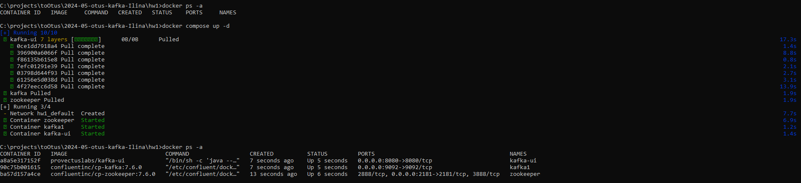
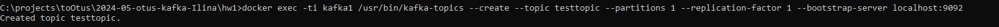
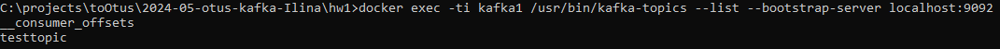
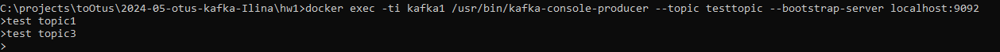
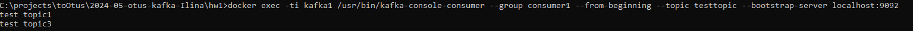
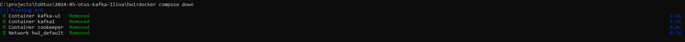

Запуск контейнеров
```shell
docker compose up -d
```

Список контейнеров
```shell
docker ps -a
```


Создать топик
```shell
docker exec -ti kafka1 /usr/bin/kafka-topics --create --topic testtopic --partitions 1 --replication-factor 1 --bootstrap-server localhost:9092
```


Получить список топиков
```shell
docker exec -ti kafka1 /usr/bin/kafka-topics --list --bootstrap-server localhost:9092
```


Отправить сообщение
Каждая строка - одно сообщение. Прервать - Ctrl+Z
```shell
docker exec -ti kafka1 /usr/bin/kafka-console-producer --topic testtopic --bootstrap-server localhost:9092
```


Получить сообщения по consumer-group consumer1
```shell
docker exec -ti kafka1 /usr/bin/kafka-console-consumer --group consumer1 --from-beginning --topic testtopic --bootstrap-server localhost:9092  
```


Остановить контейнеры
```shell
docker compose down
```
