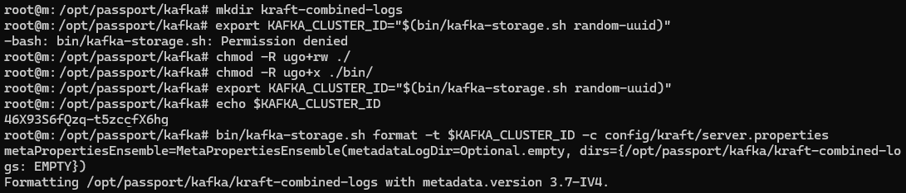
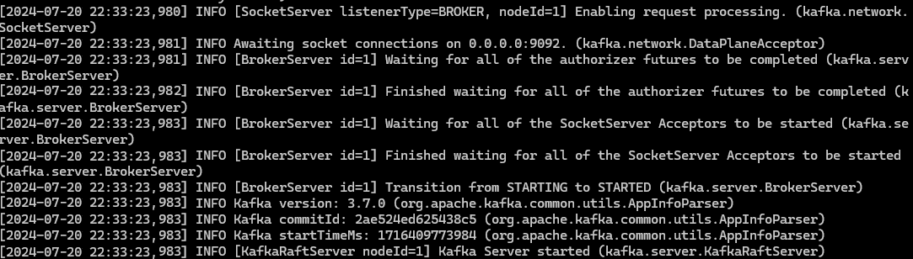
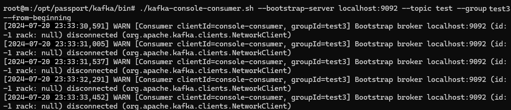
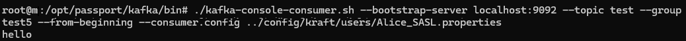
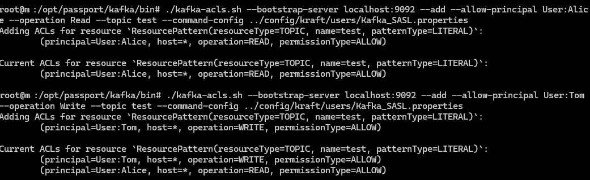
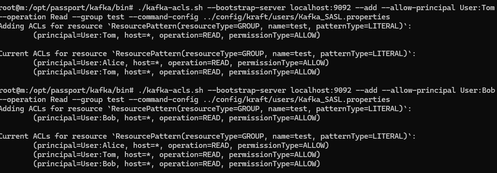
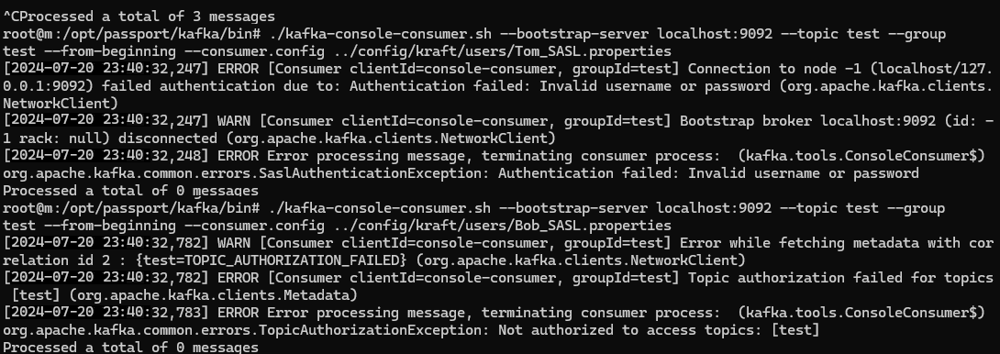
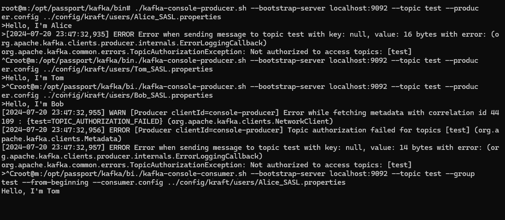

## Генерация идентификатора кластера

```shell
bin/kafka-storage.sh random-uuid
```

Создание директории kraft-combined-logs
```shell
bin/kafka-storage.sh format -t $KAFKA_CLUSTER_ID -c config/kraft/server.properties
```



Старт брокера:


## Настройка SASL/PLAIN для kafka

Настройки отоброжены в файле sasl-server.properties
Основным пользователем для брокера является Kafka. Созданы 3 пользователя: Alice, Bob, Tom


## Запуск брокера с новым конфигурационным файлом:

```shell
bin/kafka-server-start.sh config/kraft/sasl-server.properties
```

## Слушаем топик без задания конфигурации пользователя:

```shell
./kafka-console-consumer.sh --bootstrap-server localhost:9092 --topic test --group test3 --from-beginning
```



## Слушаем топик с заданием конфигурации пользователя:

```shell
./kafka-console-consumer.sh --bootstrap-server localhost:9092 --topic test --group test5 --from-beginning --consumer.config ../config/kraft/users/Alice_SASL.properties
```



## Настройка авторизации

Для следующий пользователей зададим следующие права на работу с топиком test:
- Alice - чтение
- Tom - запись
- Bob - отсутствуют права

```shell
./kafka-acls.sh --bootstrap-server localhost:9092 --add --allow-principal User:Alice --operation Read --topic test --command-config ../config/kraft/users/Kafka_SASL.properties
./kafka-acls.sh --bootstrap-server localhost:9092 --add --allow-principal User:Tom --operation Write --topic test --command-config ../config/kraft/users/Kafka_SASL.properties
./kafka-acls.sh --bootstrap-server localhost:9092 --add --allow-principal User:Alice --operation Read --group test --command-config ../config/kraft/users/Kafka_SASL.properties
./kafka-acls.sh --bootstrap-server localhost:9092 --add --allow-principal User:Tom --operation Read --group test --command-config ../config/kraft/users/Kafka_SASL.properties
./kafka-acls.sh --bootstrap-server localhost:9092 --add --allow-principal User:Bob --operation Read --group test --command-config ../config/kraft/users/Kafka_SASL.properties
```

Результат выдачи прав:



Попробуем прочитать топик test каждым пользователем:


Попробуем записать в топик какое либо сообщение:



