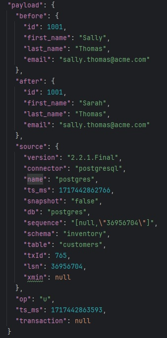

PostgreSQL CDC
1. Запуск Kafka и Kafka Connect
```shell
docker compose up -d
```

2. Проверка статуса Kafka Connect
```shell
curl http://localhost:8083 | jq
```

3. Проверка плагинов коннекторов
```shell
curl http://localhost:8083/connector-plugins | jq
```

4. Подключение к базе и проверка таблицы.
```shell
docker exec -ti -e PGOPTIONS="--search_path=inventory" postgres psql -U postgres
SELECT * FROM customers;
\q
```

5. Создание коннектора "inventory-connector"
```shell
cat ./inventory.json
```
```shell
curl -X POST --data-binary "@inventory.json" -H "Content-Type: application/json" http://localhost:8083/connectors | jq
```

6. Проверка коннектора "inventory-connector"
```shell
curl http://localhost:8083/connectors | jq
curl http://localhost:8083/connectors/inventory-connector/status | jq
```

7. Проверка топиков
```shell
docker exec kafka1 kafka-topics --list --bootstrap-server kafka1:19092,kafka2:19093,kafka3:19094
```
8. Чтение сообщений
[Kafka-ui Link](http://localhost:8081/)
[AKHQ UI Link](http://localhost:8080/)

9. Чтение топика "postgres.inventory.customers"
```shell
docker exec kafka1 kafka-console-consumer --topic postgres.inventory.customers --bootstrap-server kafka1:19092,kafka2:19093,kafka3:19094 --from-beginning --property print.offset=true
```

10. Обновление записи в таблице
```shell
docker exec -ti -e PGOPTIONS="--search_path=inventory" postgres psql -U postgres
UPDATE customers SET first_name = 'Sarah' WHERE id = 1001;
SELECT * FROM customers;
\q
```

11. Чтение нового сообщения в топике



12. Удаление коннектора
```shell
curl -X DELETE http://localhost:8083/connectors/inventory-connector
curl http://localhost:8083/connectors | jq
```

13. Остановка Kafka и Kafka Connect
```shell
docker compose stop
docker container prune -f
docker volume prune -f
```